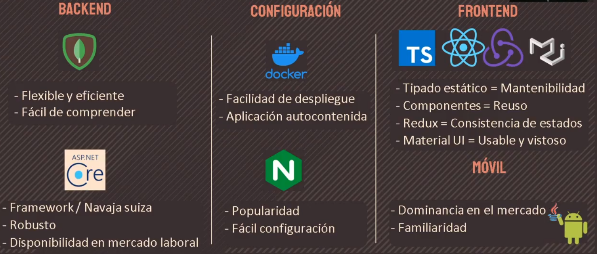

# 👞 Zapapp

## Objetivo General

Desarrollar un sistema de gestión de servicios de remiendo para mejorar el
control sobre las solicitudes de servicio y brindar a los clientes de opciones
adicional de servicio, disminuir la exposición de los clientes atendiendo la crisis
sanitaria y apoyar al local a tener mejor manejo de los datos para su futuro
procesamiento.

## Objetivos Específicos

- Reducir la necesidad de los clientes de visitar físicamente el
  establecimiento.
- Gestionar el flujo de pedidos que son solicitados a la sucursal con un sistema de
  información.

## Tecnologías utilizadas

### Justificación

### Frontend

- React & Redux
- Material UI

### Backend

- ASP .NET
- MongoDB (User Authentication)

### Mobile

- Java

### Otros

- Docker (para CI/CD)
- Nginx
- Firebase (Cloud storage & messaging para almacenar imágenes y enviar notificaciones Pop-out)

## Notas / Trabajos futuros

- Docker-compose para desplegar los contenedores del Back y front simultaneamente

## Autores

- Elías Soria ([@SRMichas](https://github.com/SRMichas)) ~ Mobile
- Miguel López ~ Frontend
- Nadia Carrillo ~ Docs
- Jesús Loera ~ Backend
